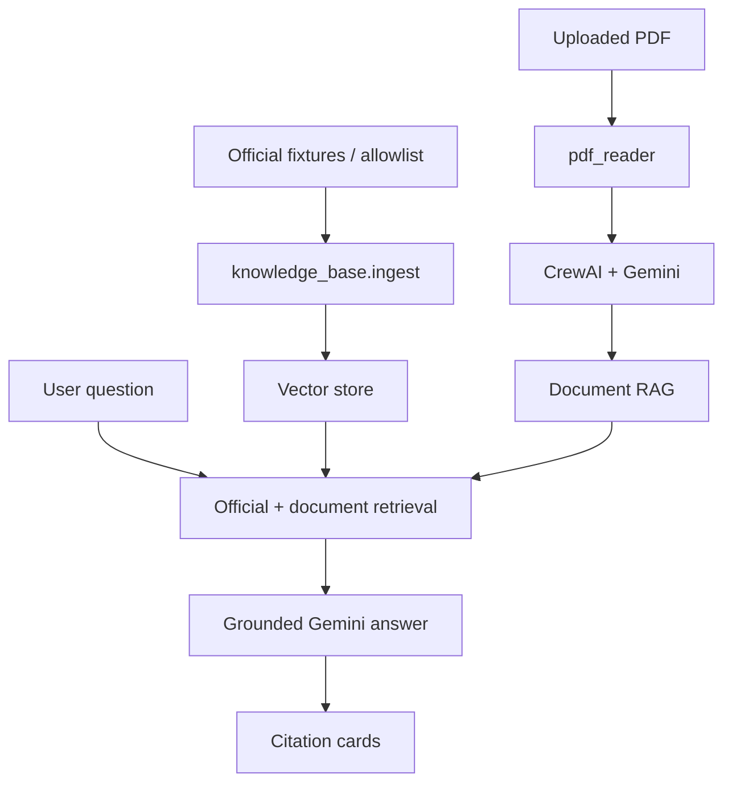

# FormBridge

FormBridge is an AI-powered assistant that helps Arabic-speaking users understand official and administrative documents written mainly in Hebrew.

Upload a PDF, choose your preferred explanation language (Arabic or simple Hebrew), and receive a structured analysis with deadlines, required actions, missing information, and a practical action plan. You can also ask follow-up questions in a document-aware chat.

## Problem Statement

Official documents in Israel are often written in formal Hebrew. For many Arabic-speaking residents, understanding these documents quickly and accurately is difficult. Misreading a deadline, payment, or required document can lead to delays, fines, or missed opportunities.

FormBridge bridges this gap by combining PDF text extraction, OCR for scanned documents, and an AI agent that explains the document in clear language and organizes the information into actionable steps.

## Target Users

- Arabic-speaking residents navigating Israeli government or administrative paperwork
- Social workers, community organizers, and volunteers helping others with official documents
- Students and professionals demonstrating practical AI-assisted document understanding

## Main Features

- PDF upload with drag-and-drop support
- Guided form/service intake: describe a situation → clarifying questions → form ID → eligibility, documents, steps, official links
- Automatic text extraction with OCR fallback for scanned PDFs
- Structured document analysis displayed in professional cards
- Explanation in **Arabic** or **simple Hebrew**
- Urgency indicators (low / medium / high)
- Numbered action plan and suggested formal Hebrew reply when relevant
- Document-aware follow-up chat with CrewAI tools (`search_official_sources`, `search_uploaded_document`)
- Official Israeli knowledge base (RAG) with citations
- Offline AI evaluations
- Download analysis as TXT or Markdown
- Privacy-focused processing (document analyzed per session, not stored on server)
- RTL support for Arabic and Hebrew content

## Technology Stack

| Component | Technology |
|-----------|------------|
| UI | Streamlit |
| AI orchestration | CrewAI |
| Language model | Gemini by default; Groq backup via `GROQ_API_KEY` / `LLM_PROVIDER` |
| PDF text extraction | pypdf |
| OCR rendering | PyMuPDF (`pymupdf`) |
| OCR engine | Tesseract (Hebrew, Arabic, English) |
| Official RAG | Local hashed embeddings + persistent vector store |
| Structured output | Pydantic |
| Configuration | python-dotenv |

## Architecture Overview



**Flow:**

1. User uploads a PDF and selects a language.
2. `pdf_reader.py` extracts embedded text; if insufficient, it runs OCR.
3. `agent.py` sends the text to Gemini via CrewAI with strict security and accuracy rules.
4. The response is parsed into a `DocumentAnalysis` Pydantic model.
5. Follow-up questions retrieve uploaded-document passages **and** official knowledge-base chunks.
6. Answers include citations. Official sources outrank Kol Zchut.

## Installation

### 1. Clone the repository

```bash
git clone <repository-url>
cd FormBridge
```

### 2. Create a virtual environment

**Windows (PowerShell):**

```powershell
python -m venv venv
.\venv\Scripts\Activate.ps1
```

**macOS / Linux:**

```bash
python3 -m venv venv
source venv/bin/activate
```

### 3. Install Python dependencies

```bash
pip install -r requirements.txt
```

### 4. Install Tesseract OCR

FormBridge uses Tesseract for scanned PDFs. Hebrew, Arabic, and English language files are included in the local `tessdata/` folder.

**Windows:**

1. Download the installer from [UB Mannheim Tesseract builds](https://github.com/UB-Mannheim/tesseract/wiki)
2. Install to the default location: `C:\Program Files\Tesseract-OCR\`
3. Optionally set a custom path:

```env
TESSERACT_CMD=C:\Path\To\tesseract.exe
```

**macOS:**

```bash
brew install tesseract
```

**Linux (Debian/Ubuntu):**

```bash
sudo apt update
sudo apt install tesseract-ocr
```

FormBridge detects Tesseract in this order:

1. `TESSERACT_CMD` environment variable
2. System `PATH` (`shutil.which`)
3. Standard Windows installation path

### 5. Configure Gemini API key

Copy the example environment file and add your key:

```bash
copy .env.example .env
```

Edit `.env`:

```env
GEMINI_API_KEY=your_actual_api_key_here
```

Obtain a key from [Google AI Studio](https://aistudio.google.com/).

## How to Run

```bash
streamlit run app.py
```

Open the URL shown in the terminal (usually `http://localhost:8501`).

## Project Structure

```text
FormBridge/
├── app.py
├── agent.py
├── rag.py                 # uploaded-document RAG
├── knowledge_base/        # official source RAG
├── pages/                 # admin Official Sources + Evals
├── evals/                 # AI evaluation suite
├── tests/
├── pdf_reader.py
├── models.py
├── ui_components.py
└── tessdata/
```

## Official knowledge base

The assistant can ground answers in an allowlisted set of Israeli sources:

1. Bituach Leumi / National Insurance Institute (`https://www.btl.gov.il/`)
2. GOV.IL
3. Israel Tax Authority
4. Population and Immigration Authority
5. Ministry of Labor
6. Ministry of Health
7. Ministry of Education
8. Local authorities (municipal / local government portal)
9. Kol Zchut — secondary explanation only

Each grounded answer shows the **source name**, a **clickable link**, and a **last-checked** (and last-updated when available) date. If no reliable official passage is found, FormBridge shows a clear warning and does not invent laws, requirements, forms, or links.

Default ingestion uses **local fixtures** (`KB_INGEST_MODE=fixtures`) so the app never crawls live sites unless you explicitly set `KB_INGEST_MODE=live`. Live mode still respects the HTTPS allowlist, delay, and retries. It will not bypass login or CAPTCHA.

```powershell
python -m knowledge_base.cli ingest
python -m knowledge_base.cli status
python -m knowledge_base.cli search --query "טופס 1500"
```

Admin pages (password: `KB_ADMIN_PASSWORD`):

- Official Sources
- Evals

### How to add an authority

Edit `knowledge_base/authorities.py`, add an allowlisted HTTPS URL, and add a fixture HTML file under `knowledge_base/fixtures/`.

## Evals

Unit tests check code. Evals check whether retrieval, citations, and safety behave as intended.

```powershell
pytest tests -q
python -m evals.run --offline
```

Offline evals use fixtures and mocked answers. They do not call Gemini and do not crawl government websites.

To add a case, append a JSON line to `evals/datasets/formbridge_eval_v1.jsonl`.

LLM-as-a-judge is opt-in (`--use-llm-judge`) and is not part of default CI.

## Security and Privacy Notes

- Uploaded documents are treated as **untrusted content**.
- AI prompts explicitly forbid following instructions inside documents.
- The API key is loaded from `.env` and never hardcoded.
- Do not commit `.env` or share your API key.
- FormBridge provides AI-generated explanations, not legal advice.

## Known Limitations

- OCR quality depends on scan resolution and document layout.
- Very long documents are truncated to a safe processing limit.
- Analysis accuracy depends on model availability and document clarity.
- Password-protected PDFs are not supported.
- Requires an active internet connection for Gemini API calls.

## Future Improvements

- Support for additional document formats (DOCX, images)
- User-selectable OCR language priority
- Persistent session export with chat history
- Multi-page document section navigation
- Offline mode with local models
- Accessibility audit and WCAG improvements

## Disclaimer

FormBridge provides informational assistance only. It is not legal, tax, medical, or government advice, and it is not affiliated with the State of Israel. Always verify important information on the linked official source. Do not upload unnecessary sensitive documents. The official knowledge base stores public source text only — never user ID numbers, medical data, or bank details.
