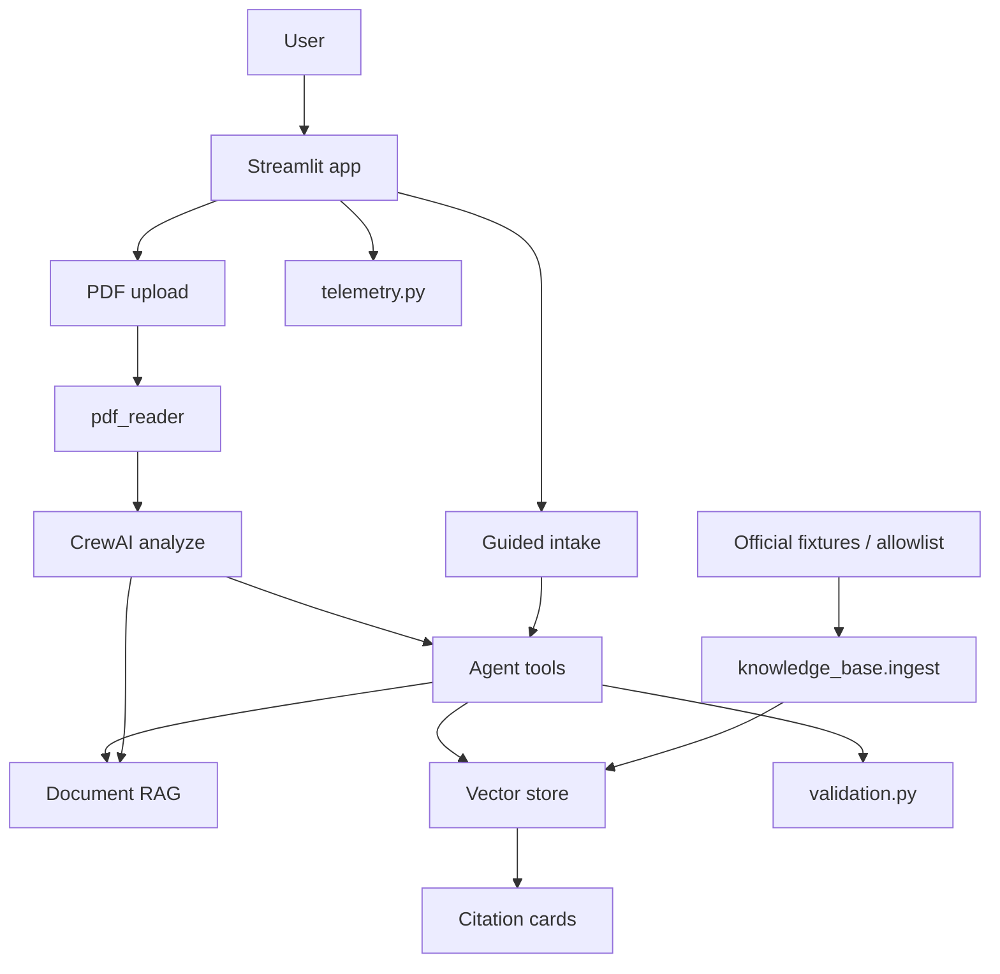

# FormBridge

FormBridge is an AI assistant that helps people navigate **Israeli official forms and documents** — especially when those documents are in formal Hebrew and the user prefers Arabic, Hebrew, or English.

It supports two workflows:

1. **Guided form assistance** — describe a situation, get clarifying questions, the right form/service, eligibility notes, required documents, important fields, steps, a pre-submission preview, and official links.
2. **Document upload** — upload a Hebrew PDF (or scanned PDF with OCR), get a structured analysis, then ask follow-up questions in a grounded chat.

FormBridge is an **informational assistant only**. It does **not** submit forms automatically and is **not** a substitute for official legal or professional advice.

## Problem Statement

Official documents and forms in Israel are often written in formal Hebrew. For many residents — especially Arabic speakers — deadlines, required documents, and filing steps can be hard to understand. Missing a detail can mean delays, fines, or a rejected application.

FormBridge bridges that gap with PDF/OCR extraction, an official-source RAG knowledge base, multilingual explanations (Arabic / Hebrew / English with RTL), and a CrewAI agent that recommends forms and grounds answers in allowlisted evidence.

## Target Users

- Residents navigating Israeli government or administrative paperwork
- Arabic-speaking users who need clear guidance on Hebrew forms
- Social workers, community organizers, and volunteers helping others
- Students and builders demonstrating practical AI + RAG + agent tooling

## Main Features

### Guided form assistance
- Situation → clarifying questions → form/service identification
- Eligibility summary, important fields, required documents, missing information
- Step-by-step instructions and a **pre-submission preview**
- Official links with citations
- **Never auto-submits** — the user files on the official site

### Document analysis
- PDF upload with drag-and-drop
- Text extraction + OCR fallback (Hebrew, Arabic, English)
- Structured analysis: summary, urgency, deadlines, actions, missing details
- Suggested formal Hebrew reply when relevant
- Document-aware follow-up chat

### RAG and grounding
- Allowlisted official Israeli sources
- Chunking, embeddings, and a local vector store
- Retrieval before answering; answers grounded in evidence
- Citation cards (source name, link, last checked / last updated)
- Refresh via `SOURCE_UPDATE_INTERVAL_HOURS`

### Agent tools
| Tool | Purpose |
|------|---------|
| `search_official_sources` | Search allowlisted official passages |
| `find_relevant_form` | Identify the likely form/service |
| `retrieve_form_instructions` | Pull filing instructions from the KB |
| `validate_user_input` | Validate Israeli ID, email, phone, date, required |
| `generate_document_checklist` | Build a required-document checklist |
| `search_uploaded_document` | RAG over the user’s uploaded PDF |

Tools return structured `STATUS=success` / `STATUS=failure` responses with validated inputs.

### Product & safety
- Arabic / Hebrew / English UI with RTL support
- Landing hero, chat, new-chat, history, suggested questions, loading states, clear errors
- Privacy notice + consent before use; sensitive values masked in logs
- Anonymized telemetry and a password-protected **Monitor** page
- Offline evals + unit tests

## Requirements checklist

| # | Area | Covered |
|---|------|---------|
| 3 | RAG system | Official collection, extract/chunk/embed/store/retrieve, grounded answers, citations, refresh |
| 4 | Form assistance | Recommend form, fields, documents, missing info, validators, preview; no auto-submit |
| 5 | Multilingual | Arabic, Hebrew, English + RTL |
| 6 | Professional UI | Landing, chat, history, suggestions, spinners, errors, source cards, responsive branding |
| 7 | Accounts & privacy | Consent gate, sensitive-value masking, secrets not in Git |
| 8 | Agent tools | Named tools, structured params, validation, success/failure, timeouts on live fetch |
| 9 | Evals & testing | Dataset + metrics + `pytest` + readable reports |
| 10 | Admin / monitoring | Official Sources, Evals, Monitor |
| 11 | Error handling & safety | API/source/PDF/incomplete/conflict handling + informational disclaimer |

## Technology Stack

| Component | Technology |
|-----------|------------|
| UI | Streamlit |
| AI orchestration | CrewAI |
| Language models | Gemini (default) + Groq backup via LiteLLM |
| PDF text | pypdf |
| OCR | PyMuPDF + Tesseract (`heb` / `ara` / `eng`) |
| Official RAG | Local hashed embeddings + file vector store |
| Auth | — (session-only; accounts not enabled) |
| Structured output | Pydantic |
| Config | python-dotenv |
| Tests | pytest + offline eval runner |

## Architecture Overview



**Typical guided flow**

1. User accepts the privacy consent and describes a situation.
2. The agent may ask clarifying questions.
3. Tools search official sources / identify the form / build a checklist.
4. FormBridge returns grounded guidance, preview, and citations — never auto-submit.

**Typical upload flow**

1. User uploads a PDF and chooses a language.
2. `pdf_reader.py` extracts text (OCR if needed).
3. `agent.py` analyzes the document into a `DocumentAnalysis` model.
4. Follow-up chat uses document RAG + official KB tools.

## Installation

### 1. Clone

```bash
git clone <repository-url>
cd FormBridge
```

### 2. Virtual environment

**macOS / Linux:**

```bash
python3 -m venv venv
source venv/bin/activate
```

**Windows (PowerShell):**

```powershell
python -m venv venv
.\venv\Scripts\Activate.ps1
```

### 3. Dependencies

```bash
pip install -r requirements.txt
```

### 4. Tesseract OCR (for scanned PDFs)

Hebrew, Arabic, and English `tessdata` files ship in `tessdata/`.

**macOS:** `brew install tesseract`  
**Linux:** `sudo apt install tesseract-ocr`  
**Windows:** install from [UB Mannheim builds](https://github.com/UB-Mannheim/tesseract/wiki)

Optional:

```env
TESSERACT_CMD=/path/to/tesseract
```

### 5. Environment

```bash
cp .env.example .env
```

Minimum useful `.env`:

```env
GEMINI_API_KEY=your_actual_api_key_here
GEMINI_MODEL=gemini/gemini-3.6-flash
LLM_PROVIDER=auto
GROQ_API_KEY=your_groq_api_key_here
GROQ_MODEL=groq/openai/gpt-oss-20b
KB_ADMIN_PASSWORD=change-me
KB_INGEST_MODE=fixtures
SOURCE_UPDATE_INTERVAL_HOURS=168
```

| Variable | Meaning |
|----------|---------|
| `LLM_PROVIDER` | `auto` (Gemini then Groq), `gemini`, or `groq` |
| `KB_INGEST_MODE` | `fixtures` (default, offline-safe) or `live` (allowlisted HTTPS only) |
| `KB_ADMIN_PASSWORD` | Unlocks Admin sidebar links + Official Sources / Evals / Monitor |
| `SOURCE_UPDATE_INTERVAL_HOURS` | Hours before KB is considered stale and refreshed |

Get a Gemini key from [Google AI Studio](https://aistudio.google.com/). Groq is optional but useful when Gemini quota is exhausted.

## How to Run

```bash
streamlit run app.py
```

Open the URL shown in the terminal (usually `http://localhost:8501`).

1. Accept the privacy consent.
2. Choose **Arabic / Hebrew / English**.
3. Use **guided mode** (default) or switch to **document upload**.
4. Optional: open **Admin** in the sidebar, unlock with `KB_ADMIN_PASSWORD`, then use Official Sources / Evals / Monitor.

Admin pages (hidden until unlocked; password-protected):

- **Official Sources** — KB status, ingest, search
- **Evals** — run/view evaluation results
- **Monitor** — anonymized counts, latency, forms, feedback, KB + eval status

## Project Structure

```text
FormBridge/
├── app.py                 # Main Streamlit UI
├── agent.py               # CrewAI agents + tools
├── models.py              # DocumentAnalysis / GuidedGuidance
├── rag.py                 # Uploaded-document RAG
├── pdf_reader.py          # PDF + OCR extraction
├── validation.py          # Israeli ID / email / phone / date validators
├── privacy.py             # Consent text + sensitive-value masking
├── telemetry.py           # Anonymized events + feedback
├── ui_components.py       # Branding, i18n, RTL, cards
├── knowledge_base/        # Official-source RAG (ingest/retrieve/CLI)
├── pages/
│   ├── 1_Official_Sources.py
│   ├── 2_Evals.py
│   └── 3_Monitor.py
├── evals/                 # Dataset, scorers, offline runner, reports
├── tests/
├── tessdata/
├── .env.example
└── requirements.txt
```

Local runtime data (`data/`, `.env`) is gitignored and must not be committed.

## Official Knowledge Base

Allowlisted sources:

1. Bituach Leumi (`https://www.btl.gov.il/`)
2. GOV.IL
3. Israel Tax Authority
4. Population and Immigration Authority (PIBA)
5. Ministry of Labor
6. Ministry of Health
7. Ministry of Education
8. Local authorities
9. Kol Zchut — **secondary explanation only**

Grounded answers show source name, HTTPS link, and last-checked / last-updated dates. If nothing reliable is found, FormBridge warns and does not invent laws, forms, fees, or links.

Default ingestion uses local fixtures (`KB_INGEST_MODE=fixtures`). Live mode respects the HTTPS allowlist, delay, retries, and timeouts — it will not bypass login or CAPTCHA.

```bash
python -m knowledge_base.cli ingest
python -m knowledge_base.cli status
python -m knowledge_base.cli search --query "טופס 1500"
```

### Adding an authority

1. Edit `knowledge_base/authorities.py` (allowlisted HTTPS URL).
2. Add a fixture HTML file under `knowledge_base/fixtures/`.
3. Re-ingest.

## Evals and Testing

```bash
pytest tests -q
python -m evals.run --offline
```

Offline evals use fixtures and mocked answers — no live model calls and no government crawling.

The dataset covers form recommendation, documents, eligibility, citation accuracy, Hebrew/Arabic/English, missing information, irrelevant questions, conflicting sources, prompt injection, and questions with no reliable answer.

Measured metrics include retrieval accuracy, groundedness, citation accuracy, task success, hallucination/safety, language quality, and response time. Reports are written to `evals/reports/`.

Add cases by appending JSON lines to `evals/datasets/formbridge_eval_v1.jsonl`.

## Security and Privacy

- Documents and retrieved text are treated as **untrusted** (prompt-injection resistant prompts).
- Secrets live in `.env` only — never commit API keys.
- Consent is required before guided/upload use.
- Telemetry stores anonymized event metadata only — **not** private question text.
- Logs mask IDs, phones, emails, and secret-looking strings.
- Avoid uploading or storing ID numbers, health data, or financial details unless necessary and protected.
- FormBridge does **not** submit forms on the user’s behalf.

## Known Limitations

- OCR quality depends on scan resolution and layout.
- Very long documents are truncated for processing.
- Accuracy depends on model availability and source coverage in the KB.
- Password-protected PDFs are not supported.
- Live model calls require network access (Gemini and/or Groq).

## Disclaimer

FormBridge provides informational assistance only. It is not legal, tax, medical, or government advice, and it is not affiliated with the State of Israel. Always verify important information on the linked official source. Do not upload unnecessary sensitive documents. The official knowledge base stores public source text only — never user ID numbers, medical data, or bank details.
